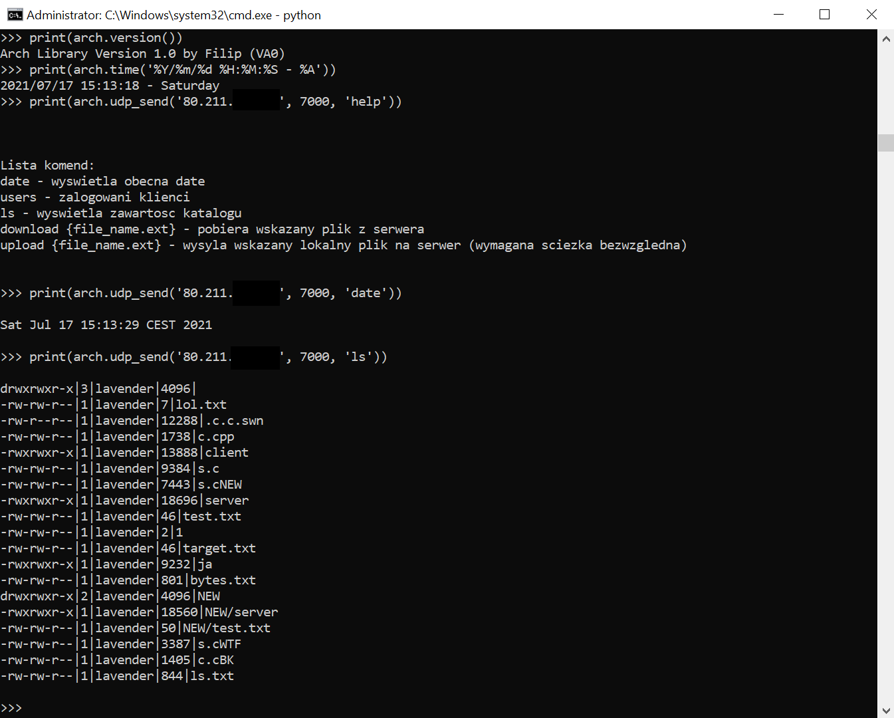

# ArchPythonExtension

Python 2.7 Simple Extension in C++

<b>Available commands are:</b>
<ul>
  <li>arch.time() - prints simplified datetime</li>
  <li>arch.time("%Y") - prints strftime format datetime (https://www.cplusplus.com/reference/ctime/strftime/)</li>
  <li>arch.udp_send('80.211.XXX.XXX', 7000, 'ls') - sends commands to UDP Socket at specified IP & Port</li>
</ul>

<b>Instalation Guide</b>

1. Install choco (PACKAGE MANAGER FOR WINDOWS)
<ul>
  <li>Set-ExecutionPolicy Bypass -Scope Process -Force; [System.Net.ServicePointManager]::SecurityProtocol = [System.Net.ServicePointManager]::SecurityProtocol -bor 3072; iex ((New-Object System.Net.WebClient).DownloadString('https://chocolatey.org/install.ps1'))</li>
</ul>

2. Install Visual C++ 2008 Service Pack 1 Redistributable Package
<ul>
  <li>choco install vcredist2008</li>
</ul>

3. Install .NET Framework 3.5
<ul>
  <li>choco install dotnet3.5</li>
</ul>

4. Install Visual C++ Compiler Package for Python 2.7 (vcpython27) (microsoft link deprecated & deleted) (using community uploaded binary)
<ul>
  <li>https://github.com/reider-roque/sulley-win-installer/blob/master/VCForPython27.msi</li>
</ul>

5. Install Extension (it will build the extension and put into Python folder)
<ul>
  <li>python setup.py install</li>
</ul>

<b>...or compily manually</b>

<ul>
  <li>g++ -c arch.cpp udp.cpp -IC:/Python27/include -D MS_WIN64</li>
  <li>g++ -shared -o arch.pyd arch.o  -LC:/Python27/libs -lPython27 -D MS_WIN64</li>
</ul>
and move arch.pyd into python executable folder
